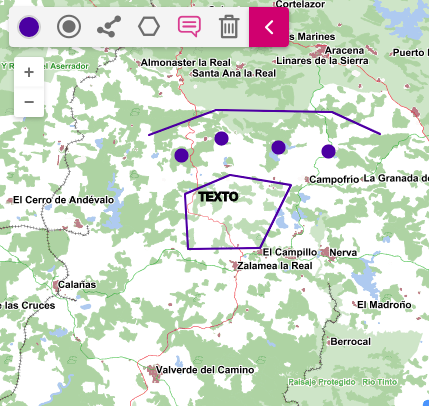

# M.plugin.FreeDraw

Plugin que permite dibujar puntos, líneas, polígonos y anotaciones sobre el mapa.



## Dependencias

- freedraw.ol.min.js
- freedraw.ol.min.css


```html
 <link href="../../plugins/freedraw/freedraw.ol.min.css" rel="stylesheet" />
 <script type="text/javascript" src="../../plugins/freedraw/freedraw.ol.min.js"></script>
```

## Parámetros

- El constructor se inicializa con un JSON de _options_ con los siguientes atributos:

- **position**. Indica la posición donde se mostrará el plugin
    - 'TL':top left (default)
    - 'TR':top right
    - 'BL':bottom left
    - 'BR':bottom right

## Ejemplos de uso

### Ejemplo 1
```javascript
   const map = M.map({
     container: 'map'
   });

   const mp = new M.plugin.FreeDraw({
        postition: 'TL',
      });

   map.addPlugin(mp);
```
### Ejemplo 2
```javascript
const mp = new M.plugin.FreeDraw();

map.addPlugin(mp);
```

